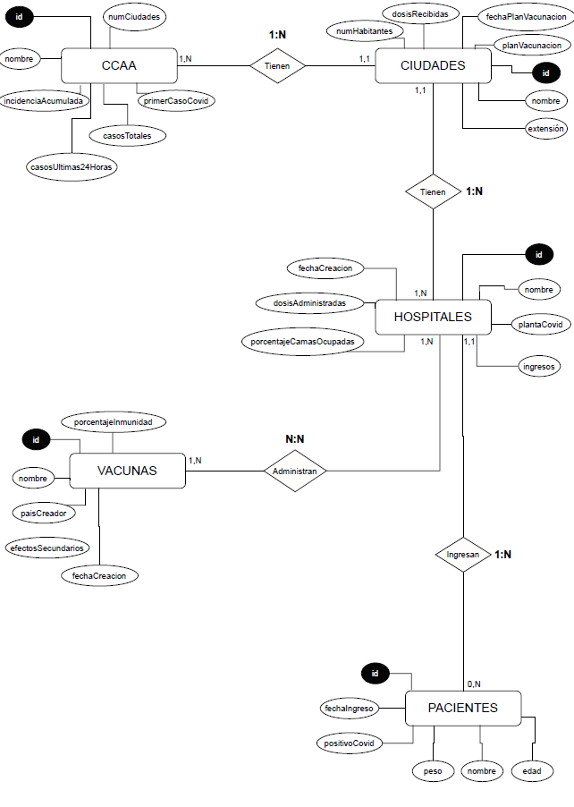

# CovidESP
### Actividad de aprendizaje 2ª EV - Acceso a Datos
Creación de una API REST con Springboot para la gestión y obtención de los datos de 
Covid-19 en España.

Clases a tratar:

- CCAA (Comunidades Autónomas)
- Ciudades
- Hospitales
- Pacientes
- Vacunas

---

### API REST - CRUD

***CCAA*** - Comunidades autónomas ---------------------------------------------------------- 

| ENDPOINT | HTTP | DESCRIPTION |
| --- | --- | --- | 
| /ccaa | GET | Devuelve todas las comunidades Autónomas |
| /ccaa/:id | GET | Devuelve una comunidad Autónoma por ID |
| /ccaa | POST | Crea una comunidad autónoma |
| /ccaa/:id | PUT | Actualiza una comunidad autónoma | 
| /ccaa/:id | DELETE | Borra una comunidad autónoma por ID | 

***CIUDADES*** --------------------------------------------------------------------

| ENDPOINT | HTTP | DESCRIPTION |
| --- | --- | --- | 
| /ciudades | GET | Devuelve todas las ciudades |
| /ciudades/:id | GET | Devuelve una ciudad por ID |
| /ciudades | POST | Crea una ciudad |
| /ciudades/:id | PUT | Actualiza una ciudad | 
| /ciudades/:id | DELETE | Borra una ciudad por ID| 

***HOSPITALES*** ------------------------------------------------------------------

| ENDPOINT | HTTP | DESCRIPTION |
| --- | --- | --- | 
| /hospitales | GET | Devuelve todos los hospitales |
| /hospitales/:id | GET | Devuelve un hospital por ID |
| /hospitales | POST | Crea un hospital |
| /hospitales/:id | PUT | Actualiza una hospital | 
| /hospitales/:id | DELETE | Borra una hospital por ID | 

***PACIENTES*** -------------------------------------------------------------------

| ENDPOINT | HTTP | DESCRIPTION |
| --- | --- | --- | 
| /pacientes | GET | Devuelve todos los pacientes |
| /pacientes/:id | GET | Devuelve un paciente por ID |
| /pacientes | POST | Crea un paciente |
| /pacientes/:id | PUT | Actualiza un paciente | 
| /pacientes/:id | DELETE | Borra un paciente por ID | 

***VACUNAS*** ---------------------------------------------------------------------

| ENDPOINT | HTTP | DESCRIPTION |
| --- | --- | --- | 
| /vacunas | GET | Devuelve todas las vacunas |
| /vacunas/:id | GET | Devuelve una vacuna por ID |
| /vacunas | POST | Crea una vacuna |
| /vacunas/:id | PUT | Actualiza una vacuna | 
| /vacunas/:id | DELETE | Borra una vacuna por ID | 

---

## CREACIÓN DB + USER

~~~
CREATE DATABASE covidesp;
CREATE USER nombre IDENTIFIED BY 'password';
GRANT ALL PRIVILEGES ON covidesp.* TO nombre;
~~~
---
#### ¡¡¡¡ ATENCIÓN !!!!
Todas las tablas y relaciones de la base de datos se crearán de forma automática 
gracias a Hibernate y JPA

---

## DIAGRÁMA ENTIDAD-RELACIÓN

---

## Capturas de pantalla del portal de Swagger
